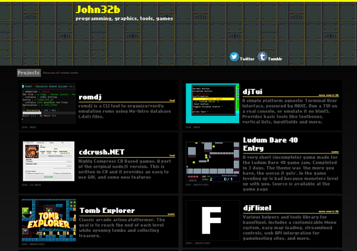

## Project Showcase Page

[See the page in action](http://john32b.github.io)

--------

#### :gem: About

Made entirely with **HAXE** code compiled to Javascript. This is a single page that demonstrates some of the projects I've worked on. Basically it loads a JSON file with project infos, and displays them on smart boxes. It uses `djWeb` which provides a simple mainframe for quickly creating one pagers.  
https://github.com/john32b/djWeb

#### :notebook: Features

* A background __tiled image scroller__ on the header.
* __Autotext effect__ where the text appears to be typed in.
* __Webm__ videos that will load when they get on view and stop playing when out of view.
* __99% Javascript__ generated _(There is a bit of HTML and CSS but it's minimal)_.
* Project boxes are dynamically loaded from an external __JSON__ file.
* Webm video loading indication.
* Warn about unsupported browsers. Limit functionality accordingly.

